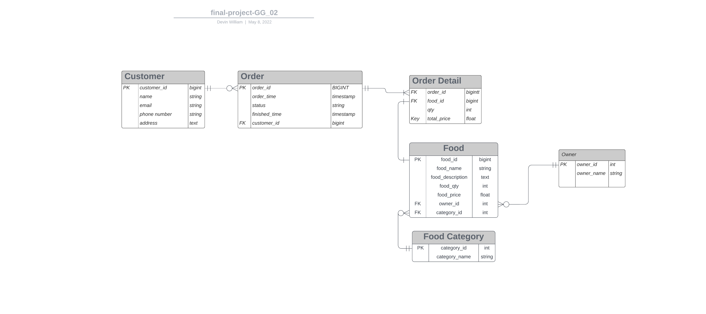

# ERD



# **Routes**

## Customer
| Method | Explanation |
|--------|-------------|
| GET|https://gigih-family-catering-devinwilliam00.gojek22.repl.co/api/v1/customers 	|
| POST| https://gigih-family-catering-devinwilliam00.gojek22.repl.co/api/v1/customers	|
| PUT|https://gigih-family-catering-devinwilliam00.gojek22.repl.co/api/v1/customers/:id	|
| DELETE|https://gigih-family-catering-devinwilliam00.gojek22.repl.co/api/v1/customers/:id|	

## Category
| Method | Explanation |
|--------|-------------|
| GET|https://gigih-family-catering-devinwilliam00.gojek22.repl.co/api/v1/categories 	|
| POST| https://gigih-family-catering-devinwilliam00.gojek22.repl.co/api/v1/categories	|
| PUT|https://gigih-family-catering-devinwilliam00.gojek22.repl.co/api/v1/categories/:id	|
| DELETE|https://gigih-family-catering-devinwilliam00.gojek22.repl.co/api/v1/categories/:id|	

## Owner
| Method | Explanation |
|--------|-------------|
| GET|https://gigih-family-catering-devinwilliam00.gojek22.repl.co/api/v1/owners 	|
| POST| https://gigih-family-catering-devinwilliam00.gojek22.repl.co/api/v1/owners	|
| PUT|https://gigih-family-catering-devinwilliam00.gojek22.repl.co/api/v1/owners/:id	|
| DELETE|https://gigih-family-catering-devinwilliam00.gojek22.repl.co/api/v1/owners/:id|	


## Order
| Method | Explanation |
|--------|-------------|
| GET|https://gigih-family-catering-devinwilliam00.gojek22.repl.co/api/v1/customers/:customer_id/orders 	|
| POST| https://gigih-family-catering-devinwilliam00.gojek22.repl.co/api/v1/customers/:customer_id/orders	|
| PUT|https://gigih-family-catering-devinwilliam00.gojek22.repl.co/api/v1/customers/:customer_id/orders/:order_id	|
| DELETE|https://gigih-family-catering-devinwilliam00.gojek22.repl.co/api/v1/customers/:customer_id/orders/:order_id|

## Detail
| Method | Explanation |
|--------|-------------|
| GET|https://gigih-family-catering-devinwilliam00.gojek22.repl.co/api/v1/customers/:customer_id/orders/:order_id/details |
| POST| https://gigih-family-catering-devinwilliam00.gojek22.repl.co/api/v1/customers/:customer_id/orders/:order_id/details|
| PUT|https://gigih-family-catering-devinwilliam00.gojek22.repl.co/api/v1/customers/:customer_id/orders/:order_id/:order_id/details/:detail_id	|
| DELETE|https://gigih-family-catering-devinwilliam00.gojek22.repl.co/api/v1/customers/:customer_id/orders/:order_id/details/:detail_id|


  ### Info
  - POST is just to make a new detail without determining the quantity of an item. Therefore, It just generates a new detail id without assigning both qty and total price column. If we want to specify a food's quantity, we can do that at the update step. </br></br> Here is what we will send
    </br>
    ```json
    {
        "order_id": 4,
        "food_id": 1
    }
    ```
    </br> The response will be
    </br>
    ```json
    {
        "id": 5,
        "qty": null,
        "total_price": null
    }
    ```
  - PUT can be used for updating both food and order quantity of an item. By modifying both controllers, the transaction will be able to handle increasing or decreasing an item.
    </br></br>
    Here is what we send
    </br>
    ```json
    {
        "order_id": 4,
        "food_id": 1,
        "qty": 1
    }
    ```

    </br> The response will look like
    </br>
    ```json
      {
        "id": 5,
        "qty": 1,
        "total_price": 22000.0
      }
    ```
    

# Food
| Method | Explanation |
|--------|-------------|
| GET|https://gigih-family-catering-devinwilliam00.gojek22.repl.co/api/v1/categories/:category_id/foods 	or <br />https://gigih-family-catering-devinwilliam00.gojek22.repl.co/api/v1/owners/:owner_id/foods |
| POST| https://gigih-family-catering-devinwilliam00.gojek22.repl.co/api/v1/categories/:category_id/foods	or <br />https://gigih-family-catering-devinwilliam00.gojek22.repl.co/api/v1/owners/:owner_id/foods|
| PUT|https://gigih-family-catering-devinwilliam00.gojek22.repl.co/api/v1/categories/:category_id/foods/:food_id	or <br />https://gigih-family-catering-devinwilliam00.gojek22.repl.co/api/v1/owners/:owner_id/foods/:food_id|
| DELETE|https://gigih-family-catering-devinwilliam00.gojek22.repl.co/api/v1/categories/:category_id/foods/:food_id or <br />https://gigih-family-catering-devinwilliam00.gojek22.repl.co/api/v1/owners/:owner_id/foods/:food_id|


